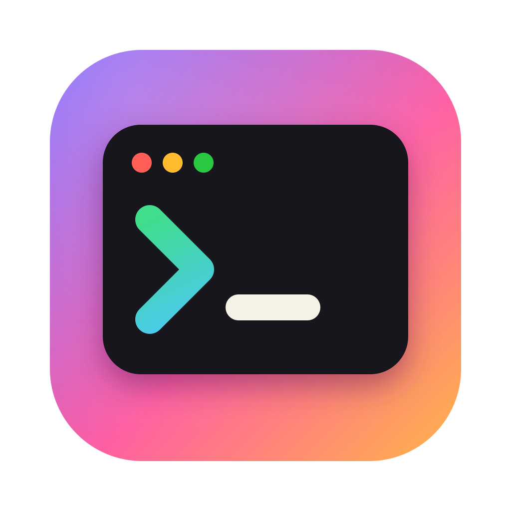

<div align="center">


# ctty7

A terminal workbench for local development, remote work and coding agents.

[English](README.md) · [简体中文](README.zh-CN.md) · [Download](https://github.com/cloudy-liu/ctty7/releases/latest)

[](https://github.com/cloudy-liu/ctty7/actions/workflows/ci.yml)
[](https://github.com/cloudy-liu/ctty7/releases/latest)
[](LICENSE)

</div>

ctty7 combines persistent terminal sessions, local and remote workspaces, Git
workflows and coding-agent awareness. It adds deeper Windows CMD/Cmder support,
Herdr host application recognition and more reliable agent-session restoration.
It is independently maintained, forked and modified from
[l0ng-ai/tty7](https://github.com/l0ng-ai/tty7), with no upstream affiliation.


## What you can do

- **Keep your workspaces together.** Organize tabs and split panes, rename sidebar
  groups, and use local terminals, WSL and SSH workspaces in one application.
  The background server owns the shells: closing a window leaves them running.
- **Use Windows shells with prompt editing.** CMD and Cmder/Clink report prompt
  boundaries and working directories for completion, ghost suggestions and
  prompt editing. Shell history keeps its native Up/Down behavior; fuzzy search
  also reads PSReadLine and Clink history. Windows paths remain selectable as a
  single range. Modified Enter events reach programs requesting ConPTY's
  win32-input-mode.
- **See Herdr and its nested agents correctly.** When Herdr is the host
  application in a pane, its sheep avatar stays visible even when it launches
  Codex or Claude Code. A split tab's avatar follows its focused pane; background
  tabs retain their last focused pane.
- **Know which agent needs attention.** Tabs and sidebar rows show working,
  blocked, done and idle states using agent hooks and Herdr-style screen
  detection. GUI screen recognition supplements hooks; the `tty7 agents` and
  `tty7 wait` commands still use hook-reported states. Support varies by agent.
- **Return to the right conversation.** Saved agent identities survive server
  replacement. Supported agents resume a known conversation; if its identity
  cannot be recovered, the pane opens a usable shell. All previously open
  workspaces can return after daemon replacement. This restores layouts and
  resumable conversations, not live processes across a system reboot.
- **Work across machines.** Use native SSH or WSL workspaces, with Windows
  in-pane SSH detection and WSL login-shell resolution. Windows packages include
  the Linux server used to bootstrap WSL without a separate download.
- **Make the workspace yours.** Theme-aware agent avatars, configurable fonts,
  selectable prompts, keyboard shortcuts and Git diff/status views are built in.
  The bell is off by default.

- **Read Markdown in place.** Open Markdown in preview, switch to source to edit,
  and install [custom reading themes](docs/customization/markdown-themes.mdx).
  Paperglow follows the app's light and dark appearance. This feature is unreleased.

## Install

Download the latest **official Release** from
[cloudy-liu/ctty7](https://github.com/cloudy-liu/ctty7/releases/latest).
There is one release channel.

| Platform | Package | Start |
|---|---|---|
| Windows x86_64 | `ctty7-<version>-windows-x86_64-setup.exe` | Run Setup, then open ctty7 from Start |
| Windows portable | `ctty7-<version>-windows-x86_64.zip` | Extract and run `tty7-app.exe` |
| macOS Apple silicon / Intel | `ctty7-<version>-macos-arm64.dmg` / `…-x86_64.dmg` | Drag the application into Applications |
| Linux x86_64 | `ctty7-<version>-linux-x86_64.AppImage` | Make executable, then run |
| Linux archive | `ctty7-<version>-linux-x86_64.tar.gz` | Extract and run `tty7-app` |

The macOS bundle directory remains `tty7.app` for compatibility. Windows builds
are unsigned; macOS builds use ad-hoc signing unless release signing credentials
are configured. The operating system may require manual confirmation.

Each release includes `checksums.txt`. The macOS ZIPs support application
updates; `tty7-server-*` assets are internal helpers for remote workspaces.

**Upgrading from the old fork:** install ctty7 v0.1.0 manually once. The old
26.x updater considers 0.1.0 a downgrade. Preserve your existing configuration
and data; see the [migration guide](docs/maintenance/migration.md).

## Get started

1. Open ctty7 and create a local terminal or choose a WSL/SSH workspace.
2. Choose your shell in Settings. Existing CMD/Cmder launch arguments remain
   supported, including `cmd.exe /K init.bat`.
3. Launch your coding agent in a pane. Under **Settings → Agents**, install hooks
   for the agents whose status and notifications you want to follow.
4. Use **Settings → About → Check now** for official updates. Packages are
   downloaded and verified before installation; applying an update is explicit.

The command remains `tty7`, including `tty7 agents` and `tty7 wait`. No `ctty7`
command alias is installed.

## Configuration and documentation

Most options are available in Settings. Configuration stays at
`%APPDATA%\tty7\config.json` on Windows and `~/.config/tty7/config.json` on
macOS/Linux. `TTY7_CONFIG_DIR` or `--config-dir` selects an isolated directory.

- [Configuration reference](docs/reference/configuration.mdx)
- [Installation and builds](docs/getting-started/installation.mdx)
- [Agent status and notifications](docs/agents/status.mdx)
- [Agent sessions](docs/agents/sessions.mdx)
- [Remote workspaces](docs/remote/workspaces.mdx)
- [Updates](docs/reference/updates.mdx)

The reference documents retain `tty7` where it names commands and internal
components. Product-specific support belongs in
[this repository's issues](https://github.com/cloudy-liu/ctty7/issues).

## Development and contributions

Use stable Rust and the native build tools for your platform. Linux also needs
X11/Wayland/font development libraries listed in the
[build instructions](docs/getting-started/installation.mdx#building-from-source).
On Windows, install the MSVC C++ build tools and Windows SDK.

```sh
git clone https://github.com/cloudy-liu/ctty7.git
cd ctty7
cargo build --locked
cargo dev
```

`cargo dev` uses `.tty7-dev` instead of your everyday configuration. Run
`cargo fmt --check` and `cargo test --locked --workspace` before submitting changes.

Rust crates, binaries, protocol identities and data paths retain their `tty7`
names to preserve compatibility and keep future selective patch imports
manageable. Pull requests target this fork. The [maintenance history](docs/maintenance/fork-history.md)
records earlier differences; the [release runbook](docs/maintenance/release.md)
covers verified publication.

## Origin and license

ctty7 is a modified distribution of tty7, licensed under [Apache-2.0](LICENSE).
Original copyright and attribution are retained. This distribution changes
Windows shell integration, agent and Herdr behavior, branding, documentation
and release/update distribution. Herdr names and detection references remain
attributed in the agent documentation.
