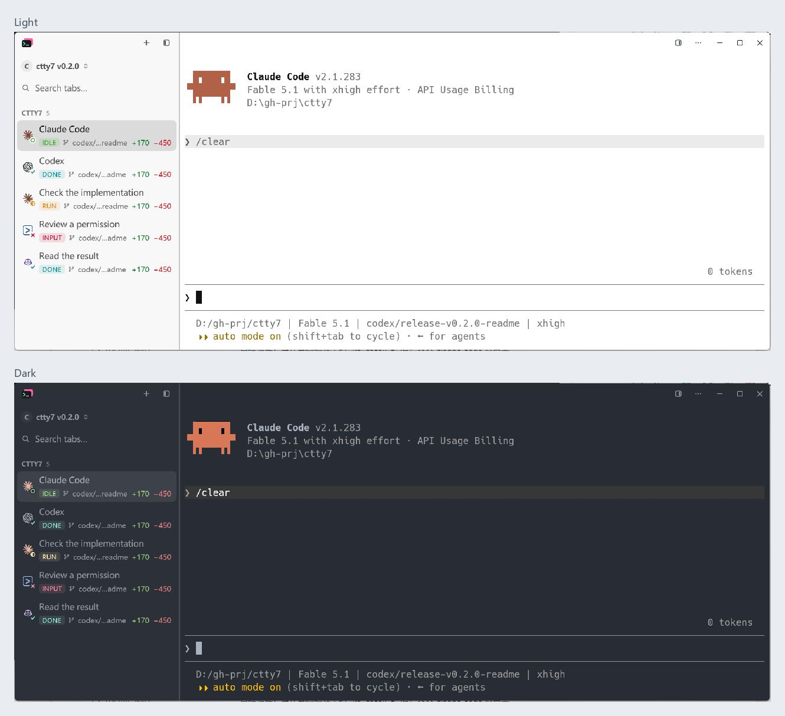
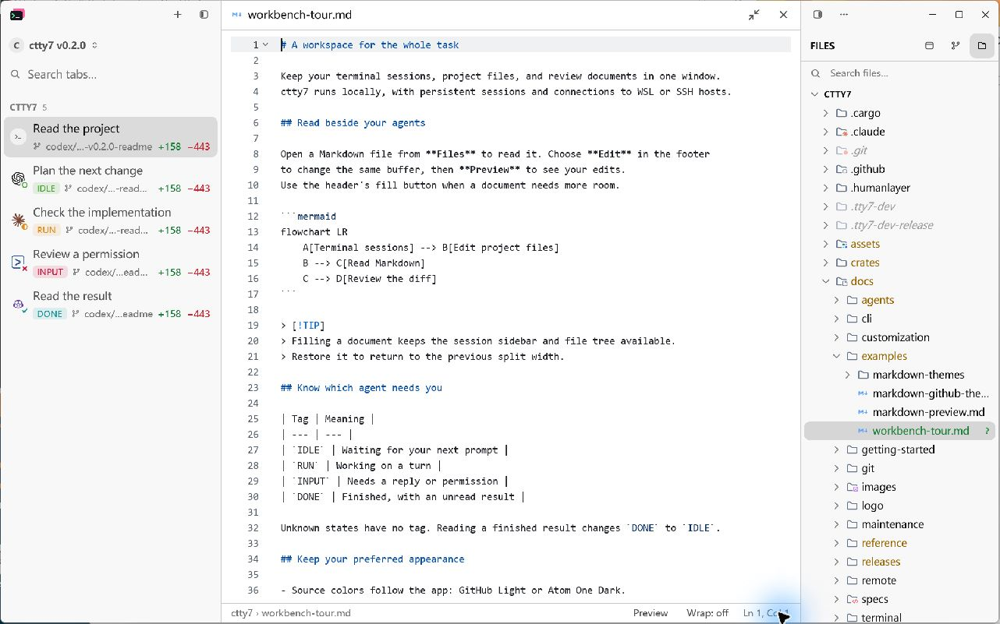

<div align="center">

<p align="center" style="line-height: 24px;">
  
  <br />
  <br />
  
</p>

cloudy 的 tty7 定制版：窗口关掉、工作继续的终端工作台，为编码 Agent 深度打磨。

[下载](https://github.com/cloudy-liu/ctty7/releases/latest) · [版本发布](https://github.com/cloudy-liu/ctty7/releases) · [文档](docs/index.mdx) · [English](README.md)

[](https://github.com/cloudy-liu/ctty7/releases/latest)
[](https://github.com/cloudy-liu/ctty7/actions/workflows/ci.yml)
[](LICENSE)

</div>



*浅色与深色原生截图：Claude Code 与 Codex 停在各自的输入提示符。[截图说明](assets/screenshots/README.md)。*

## 这是什么

ctty7 是 cloudy 维护的 [tty7](https://github.com/l0ng-ai/tty7) 定制版本。tty7 是用 Rust 编写的终端工作台：shell 属于后台服务，而不是窗口，关掉应用，构建、Agent 任务和会话都继续运行；重启之后，布局、屏幕内容和受支持的 Agent 对话都会回来，不需要 tmux。这种持久化配上接近编辑器的输入体验、逐面板的 Agent 感知和原生 SSH 与 WSL 支持，全部是纯 Rust、GPU 渲染；上游基准测试中，大文件 `cat` 的吞吐约为 Alacritty、Ghostty 或 Kitty 的两倍。

ctty7 完整保留这些，把重心放在日常使用真正需要的地方：Windows shell、编码 Agent，以及同一个窗口里的阅读和编辑。每一项改动及其上游状态都记录在[定制历史](docs/maintenance/fork-history.md)中，适合上游的修改也会提交回上游。

## ctty7 改了什么

**Windows shell 是一等公民。** 原生 CMD 和 Cmder/Clink 获得提示符边界、工作目录上报、补全、灰色建议和行内编辑；Up/Down 保留 shell 原生历史，模糊搜索读取 PSReadLine 与 Clink 历史文件。Windows 路径可以作为整体选中；带修饰的 Enter 会送达请求 ConPTY win32-input-mode 的程序，而不是直接提交整行。[Shell 集成](docs/reference/shell-integration.mdx)

**一眼看清哪个 Agent 需要你。** 侧栏行用紧凑的 idle、run、input、done 标签标出状态：谁在干活、谁在等你、谁的结果还没读，一眼可辨。已知对话在重启和 daemon 替换后仍能恢复：Claude Code 和 Codex 续上原会话；身份无法识别时，恢复流程留下可用的 shell，而不是弹出会话选择器。Agent 识别沿 Windows 进程树进行，提示符助手和 MCP 子进程不会被误认成前台 Agent；头像跟随主题。[Agent 状态](docs/agents/status.mdx) · [会话恢复](docs/agents/sessions.mdx)

**在同一个窗口里阅读和编辑。** Markdown 以 GitHub 风格预览打开，支持 Mermaid 图表和可安装的 v2 主题，与源码编辑共用同一缓冲区。源码配色跟随深浅模式，浅色 GitHub Light、深色 Atom One Dark，字体、字号独立设置。文件树和编辑器标题使用 Symbols 图标，文档可以填满和还原，diff 可以切换并排与统一布局。[Markdown 主题](docs/customization/markdown-themes.mdx)



**远程工作不用折腾。** WSL 解析账户的登录 shell，Windows 安装包内置启动 WSL 所需的 Linux server。面板内启动的 `ssh` 会被识别，侧栏切换到远程上下文，而不是停留在本地。[远程工作区](docs/remote/workspaces.mdx) · [SSH](docs/remote/ssh.mdx)

**自己的发布线。** ctty7 维护自己的版本发布，应用内检查更新不依赖 GitHub REST API；终端响铃默认关闭。[更新机制](docs/reference/updates.mdx)

## 安装

从 [GitHub Releases](https://github.com/cloudy-liu/ctty7/releases/latest) 选择对应的安装包。

| 平台 | 文件 | 启动方式 |
| --- | --- | --- |
| Windows x64 | `ctty7-*-windows-x86_64-setup.exe` | 运行安装程序，从开始菜单启动 ctty7。 |
| Windows x64 便携版 | `ctty7-*-windows-x86_64.zip` | 解压后运行 `tty7-app.exe`。 |
| macOS Apple Silicon | `ctty7-*-macos-arm64.dmg` | 将 ctty7 拖入 Applications。 |
| macOS Intel | `ctty7-*-macos-x86_64.dmg` | 将 ctty7 拖入 Applications。 |
| Linux x64 | `ctty7-*-linux-x86_64.AppImage` | 添加执行权限后运行。 |
| Linux x64 压缩包 | `ctty7-*-linux-x86_64.tar.gz` | 解压后运行 `tty7-app`。 |

每次发布都附带 `checksums.txt`。Windows 安装包未签名；macOS 使用 ad hoc 签名，尚未公证。旧 26.x 版本需要[手动迁移一次](docs/maintenance/migration.md)，之后即可沿 0.x 版本线更新。检查更新入口是 **设置 → 关于 → 立即检查**。

CLI 命令仍叫 `tty7`，可执行文件和配置目录也保留原有名称。

## 配置与构建

大多数选项可以在设置中修改。Windows 配置位于 `%APPDATA%\tty7\config.json`，macOS/Linux 位于 `~/.config/tty7/config.json`；使用 `TTY7_CONFIG_DIR` 环境变量或 `--config-dir` 参数可以指定独立目录。[配置参考](docs/reference/configuration.mdx) · [界面主题](docs/customization/themes.mdx)

使用 stable Rust。Windows 需要 MSVC C++ 构建工具和 Windows SDK；macOS 需要 Xcode command line tools；Linux 需要[对应的系统依赖](docs/getting-started/installation.mdx#building-from-source)。

```sh
git clone https://github.com/cloudy-liu/ctty7.git
cd ctty7
cargo build --locked
cargo dev
```

`cargo dev` 使用隔离的 `.tty7-dev` 配置目录。提交前运行 `cargo fmt --all -- --check` 和 `cargo test --locked --workspace`。Windows 完整测试还需要把 Git for Windows 的 `usr/bin` 工具目录加入测试进程的 PATH。

Issue 和 PR 提交到 [cloudy-liu/ctty7](https://github.com/cloudy-liu/ctty7)，PR 目标分支为该仓库的 `main`。维护信息见[项目状态](docs/maintenance/status.md)、[发布流程](docs/maintenance/release.md)和[定制历史](docs/maintenance/fork-history.md)。

## 来源与许可

ctty7 基于 [l0ng-ai/tty7](https://github.com/l0ng-ai/tty7) 维护，保留原始版权与署名，采用 [Apache-2.0](LICENSE) 许可。

文件和文件夹图标来自 Miguel Solorio 的 [Symbols](https://github.com/miguelsolorio/vscode-symbols)，采用 MIT 许可。其他内置主题与素材的许可说明保留在 `assets/` 中。
