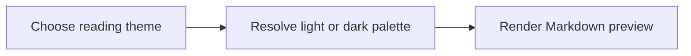

# GitHub Markdown acceptance sample

Read this file in ctty7 and on GitHub with Light default and Dark default.
Body text includes **semibold**, *emphasis*, ~~deleted text~~, a
[link to this section](#github-markdown-acceptance-sample), and 中文混合排版。

## Heading with `inline code`

### Third-level heading

#### Fourth-level heading

##### Fifth-level heading

###### Sixth-level heading

A paragraph with `padded inline code`, adjacent `chips`, and
<kbd>Ctrl</kbd> + <kbd>Shift</kbd> + <kbd>P</kbd>. Select across these
elements and copy the result, then switch between GitHub and an installed v2 custom theme.

> Ordinary quotation with **emphasis**, `code`, and a [link](https://github.com).
>
> > Nested quotation retains the selected reading palette.

> [!NOTE]
> Notes use an info icon and a blue border and title.

> [!TIP]
> Tips use a light-bulb icon and a green border and title.

> [!IMPORTANT]
> Important information uses a report icon and a purple border and title.

> [!WARNING]
> Warnings use an alert icon and an amber border and title.

> [!CAUTION]
> Cautions use a stop icon and a red border and title.

## Lists and tasks

- Solid bullet
  - Hollow bullet
    - Square bullet

1. Decimal marker
   1. Roman marker
      1. Alphabetic marker

- [x] Completed task
- [ ] Pending task

## Tables

| Key | Value |
|---|---|
| Theme | `github` |
| Shortcut | <kbd>Ctrl</kbd> |
| Variant | Light / Dark |

| Long column A | Long column B | Long column C | Long column D |
|---|---|---|---|
| `one_long_unbroken_value_that_requires_local_horizontal_scrolling` | `another_long_unbroken_value_that_requires_local_horizontal_scrolling` | `third_long_unbroken_value_that_requires_local_horizontal_scrolling` | `fourth_long_unbroken_value_that_requires_local_horizontal_scrolling` |
| Second row | Second row | Second row | Second row |

---

## Code and diff

```rust
// Comment, keywords, numbers, strings and types
pub fn greet(name: &str) -> String {
    let count = 42;
    format!("Hello, {name}: {count}")
}
```

```diff
diff --git a/config.json b/config.json
--- a/config.json
+++ b/config.json
@@ -1,3 +1,3 @@
-  "markdown_theme": "old-theme"
+  "markdown_theme": "github"
   "enabled": true
```



## Position and editing state

Scroll here, select a few words, switch reading themes, and return to the editor.
The same buffer, unsaved changes, selection and reading position should remain.
