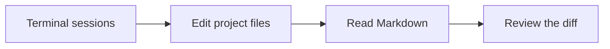

# A workspace for the whole task

Keep your terminal sessions, project files, and review documents in one window.
ctty7 runs locally, with persistent sessions and connections to WSL or SSH hosts.

## Read beside your agents

Open a Markdown file from **Files** to read it. Choose **Edit** in the footer
to change the same buffer, then **Preview** to see your edits.
Use the header's fill button when a document needs more room.

> [!TIP]
> Filling a document keeps the session sidebar and file tree available.
> Restore it to return to the previous split width.

## Know which agent needs you

| Tag | Meaning |
| --- | --- |
| `IDLE` | Waiting for your next prompt |
| `RUN` | Working on a turn |
| `INPUT` | Needs a reply or permission |
| `DONE` | Finished, with an unread result |

Unknown states have no tag. Reading a finished result changes `DONE` to `IDLE`.

## Keep your preferred appearance

- Source colors follow the app: GitHub Light or Atom One Dark.
- Source font, size, and line height are independent of terminal typography.
- GitHub is the built-in Markdown theme; v2 YAML packages add custom themes.
- The file tree shows dotfiles and uses Symbols file and folder icons.
