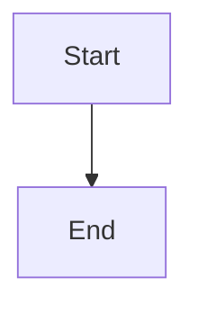

# Mermaid diagram support

ctty7 renders Mermaid diagrams in Markdown preview. This is available in
source builds from `main`, after the published v0.1.0 release.

## Usage

Use a fenced code block with the `mermaid` language identifier:

~~~markdown

~~~

The diagram renders as an SVG in the native reading view. Its toolbar copies
the original source or opens a larger viewer with zoom, pan and reset controls.
Fences accept both LF and Windows CRLF line endings without changing the source
buffer or the copied diagram code.

## Diagram types

Rendering uses `merman` 0.7. Supported syntax depends on that renderer; it does
not guarantee every feature of the browser Mermaid implementation. Diagram
families include:

- **Flowcharts** (`graph`, `flowchart`)
- **Sequence Diagrams** (`sequenceDiagram`)
- **Class Diagrams** (`classDiagram`)
- **State Diagrams** (`stateDiagram`)
- **Entity Relationship** (`erDiagram`)
- **User Journey** (`journey`)
- **Gantt Charts** (`gantt`)
- **Pie Charts** (`pie`)
- **Requirement Diagrams** (`requirementDiagram`)
- **Git Graphs** (`gitGraph`)
- **Mindmaps** (`mindmap`)
- **Quadrant Charts** (`quadrantChart`)

## Theme integration

The built-in GitHub reading theme uses Mermaid's `default` or `dark` element
colors and a transparent canvas over the application background. Switching
application appearance updates the diagrams.

Custom v2 themes supply their reading palette to the renderer:

| Theme Element | Used For |
|--------------|----------|
| `background` | Canvas background |
| `paper` | Surface elements (boxes, cards) |
| `foreground` | Text color |
| `border` | Lines and borders |
| `accent` | Activation bars, highlights |
| `code_background` | Actor boxes in sequence diagrams |
| `quote_background` | Note boxes |

The colors adapt automatically when switching between light and dark modes.

## Custom themes

To customize how Mermaid diagrams look, edit your Markdown theme file:

```yaml
# ~/.config/tty7/markdown-themes/my-theme.yaml
schema_version: 2
id: my-theme
name: My Custom Theme

light:
  accent: '#0066cc'      # Controls activation bars
  border: '#cccccc'      # Controls lines and borders
  # ... other colors
  
dark:
  accent: '#3b82f6'
  border: '#444444'
  # ... other colors
```

## Implementation

The reading view replaces Mermaid fences with loading placeholders and renders
SVGs on the background executor. Completed images replace the placeholders;
results from an older document/theme generation are discarded. The current
view retains its rendered images until content or theme changes replace them.

### Source files

- [markdown_mermaid.rs](../src/ui/markdown_mermaid.rs) handles theme integration, rendering and the expanded viewer.
- [markdown_preview.rs](../src/ui/markdown_preview.rs) handles fence preprocessing, background work, image state and toolbar controls.

### Custom theme mapping

```rust
HostThemeRoles {
    canvas: palette.background,
    surface: palette.paper,
    text: palette.foreground,
    border: palette.border,
    activation_background: palette.accent,
    actor_background: palette.code_background,
    note_background: palette.quote_background,
    // ... semantic colors stay fixed
}
```

## Error handling

If a diagram fails to render, the reading view falls back to the original code
block. Preprocessing records the renderer error in an HTML comment; it does not
provide a dedicated line-number error panel.

## Examples

Use the [GitHub acceptance sample](examples/markdown-github-theme.md) for a
flowchart and the [reading theme guide](customization/markdown-themes.mdx) for
v2 installation and palette fields. See the
[verification record](testing/markdown-github-theme.md) for native checks.

## Limitations

- In-diagram click handlers and links are not supported. The application's copy and expanded-view controls are separate.
- Native/browser glyph rasterization and all Mermaid horizontal geometry are not guaranteed to match.
- Complex diagrams still require rendering time, even though rendering runs in the background.

## Possible follow-ups

These are proposals, not open implementation tickets. Current tracked work is
listed in [project status](maintenance/status.md).

- Reuse SVGs across document or theme generations with a source/theme cache.
- Export individual diagrams to PNG/SVG files.
- Show a live preview while editing Mermaid source.
- Add diagram-specific theme overrides.
- Highlight errors with line numbers.

## Viewer controls

Expand and source Copy appear at the upper right. Directional movement, Reset,
and zoom controls appear at the lower right, both inline and in the larger
viewer. Drag the diagram to move it; Reset restores its initial fit and
position. Controls follow the active Markdown palette and retain the original
source when copying.
