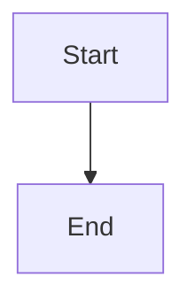

# Mermaid Diagram Support

tty7 now supports rendering Mermaid diagrams directly in Markdown preview with full theme integration.

## Usage

Simply use a code block with `mermaid` language identifier:

~~~markdown

~~~

The diagram will be automatically rendered as an SVG embedded in the preview.

## Supported Diagram Types

All Mermaid diagram types are supported:

- **Flowcharts** (`graph`, `flowchart`)
- **Sequence Diagrams** (`sequenceDiagram`)
- **Class Diagrams** (`classDiagram`)
- **State Diagrams** (`stateDiagram`)
- **Entity Relationship** (`erDiagram`)
- **User Journey** (`journey`)
- **Gantt Charts** (`gantt`)
- **Pie Charts** (`pie`)
- **Requirement Diagrams** (`requirementDiagram`)
- **Git Graphs** (`gitGraph`)
- **Mindmaps** (`mindmap`)
- **Quadrant Charts** (`quadrantChart`)

## Theme Integration

Mermaid diagrams automatically inherit colors from the current Markdown theme:

| Theme Element | Used For |
|--------------|----------|
| `background` | Canvas background |
| `paper` | Surface elements (boxes, cards) |
| `foreground` | Text color |
| `border` | Lines and borders |
| `accent` | Activation bars, highlights |
| `code_background` | Actor boxes in sequence diagrams |
| `quote_background` | Note boxes |

The colors adapt automatically when switching between light and dark modes.

## Custom Themes

To customize how Mermaid diagrams look, edit your Markdown theme file:

```yaml
# ~/.config/tty7/markdown-themes/my-theme.yaml
schema_version: 1
id: my-theme
name: My Custom Theme

light:
  accent: '#0066cc'      # Controls activation bars
  border: '#cccccc'      # Controls lines and borders
  # ... other colors
  
dark:
  accent: '#3b82f6'
  border: '#444444'
  # ... other colors
```

## Architecture

The integration works as follows:

1. **Preprocessing**: During Markdown parsing, code blocks with `mermaid` language are identified
2. **Theme Extraction**: Colors are extracted from the current Markdown theme
3. **Rendering**: The `merman` renderer converts the diagram source to SVG using the theme colors
4. **Embedding**: The SVG is embedded directly into the HTML preview

### Code Structure

- `src/ui/markdown_mermaid.rs` - Theme integration and rendering
- `src/ui/markdown_preview.rs` - Mermaid block preprocessing

### Theme Mapping

```rust
HostThemeRoles {
    canvas: palette.background,
    surface: palette.paper,
    text: palette.foreground,
    border: palette.border,
    activation_background: palette.accent,
    actor_background: palette.code_background,
    note_background: palette.quote_background,
    // ... semantic colors stay fixed
}
```

## Error Handling

If a Mermaid diagram fails to render (syntax error, unsupported feature), the original code block is displayed with an error message prefix.

## Performance

- Diagrams are rendered synchronously during preview generation
- Complex diagrams may add slight delay to preview updates
- Future optimization: cache rendered SVGs keyed by (source, theme, dark_mode)

## Examples

See `test-mermaid.md` for comprehensive examples of all diagram types.

## Limitations

- No interactive features (Mermaid's interactive elements are not supported)
- No click handlers or links within diagrams
- Diagram complexity is limited by the renderer's capabilities

## Future Enhancements

Potential improvements:

- [ ] Cache rendered diagrams to improve performance
- [ ] Export individual diagrams to PNG/SVG files
- [ ] Live preview while editing Mermaid source
- [ ] Diagram-specific theme overrides
- [ ] Error highlighting with line numbers
