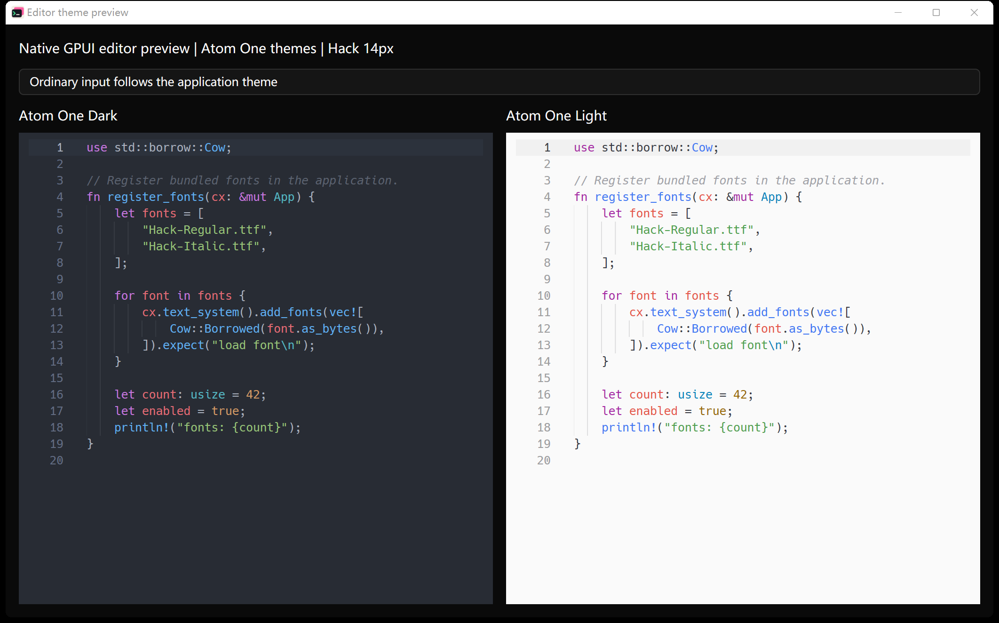
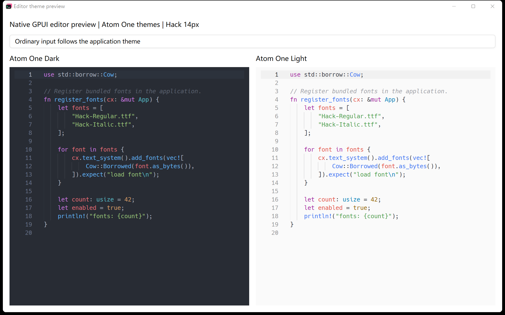

# Editor theme verification

Spec: [cloudy-liu/ctty7#84](https://github.com/cloudy-liu/ctty7/issues/84).
Verification ran on Windows on 2026-10-03.

The application pins `cloudy-liu/gpui-component` at
`833b0e084a12a3a0561d1e844b307e120cb37123`. Both component packages and
the transitive macro package resolve to that revision in `Cargo.lock`.

## Initial implementation checks

| Check | Result |
| --- | --- |
| Component library: `cargo test --locked -p gpui-component --lib --features tree-sitter-languages` | 291 passed |
| Application: `cargo test --locked --workspace --features updater` | 2,938 passed, 6 ignored, 0 failed |
| Windows workspace build: `cargo build --locked` | Passed |
| `cargo fmt --check` and `git diff --check` | Passed |
| `bash .github/scripts/check-host-boundary.sh` | Passed, 98 UI/terminal files checked |

The application tests exercise the rendered settings dropdown and search,
all six preference/appearance combinations, theme preview cancellation, and
configuration reload. They preserve typed content, the dirty flag, selection,
cursor, scroll position and undo. Compatibility tests cover absent fields,
unknown theme IDs and malformed field types.

Token tests inspect actual highlighted text ranges in Rust, TypeScript,
JavaScript, Python and JSON. Rust samples cover bindings, module paths in
imports and types, functions, escapes, constants, constructors and macro
injections. The shared Rust language registration remains unchanged. The
component test draws an overridden editor beside an ordinary editor and
changes the override without replacing either buffer.

## Search integration checks

Integration with `main@92297d13` retains the current-match visibility fix from
[cloudy-liu/ctty7#87](https://github.com/cloudy-liu/ctty7/pull/87). The source
editor receives one complete style. Its search fills use the resolved editor
background and foreground, plus the application accent, so opposite app/editor
appearances use the editor's actual contrast budget.

The regression command is:

```powershell
cargo test --locked -j 2 --bin tty7-app editor_search_highlights -- --nocapture
```

Before the fix, this test failed because the current match had less than 1.89:1
contrast against the editor background. After the fix, it passed for all three
editor preferences, every built-in application theme, Rust and plain-text
palettes, and colored, gray and editor-background-colored accents. It checks
separate opaque search fills and preserves the selection, caret and syntax
palette. These are color-contract checks; they do not replace native visual
acceptance.

The integrated workspace check,
`cargo test --locked --workspace --features updater -j 2`, passed 2,939 tests
with 6 ignored and no failures. Formatting, whitespace and Host boundary
checks also passed, as did the Windows `cargo build --locked -j 2`.
The component revision is unchanged, so the component
results above remain the initial implementation's checks.

## Native component previews

These images show native GPUI `Input` components with the shipped palettes,
Rust query adaptation and bundled Hack font. They are component previews,
not screenshots of the full tty7 application. Each window contains two
independently styled editors and one ordinary input using the app colors.

Dark application appearance:



Light application appearance:



Both editor backgrounds remain opaque, including when their appearance
differs from the containing window. The preview was built against the pinned
component revision above.

## Rendering performance sample

A temporary native preview scrolled two 4,750-line Rust buffers, swapped editor
styles every 30 frames and inserted text every 15 frames. It recorded intervals
between native frame callbacks, discarded 20 warm-up frames and retained 160
frames. The runs used the Windows debug build with compilation stopped.

| Input styling | Mean frame interval | 95th percentile | Average frame rate |
| --- | --- | --- | --- |
| Instance editor palettes | 28.258 ms | 35.241 ms | 35.39 fps |
| Application palette fallback | 28.271 ms | 33.965 ms | 35.37 fps |

This sample did not show a material average slowdown from instance colors.
It is a debug-build stress comparison, not a release-performance guarantee
or a comparison with the previous component revision.

## Review

Standards review found no remaining code-standard violations or code-smell
findings. Its dependency-pin and rendering-profile checks are recorded above.

Spec review found incorrect Rust type-path captures and global colors in
folding/scrollbar controls. Both were corrected. Follow-up tests also exposed
constant-capture priority; the original Rust rules now precede the variable
fallbacks. Full-suite regression caught the new `automatic` search keyword
displacing the existing update-settings result; the broad keyword was removed.

## Verification limits

The isolated full-app instance failed to open a terminal with
`no answer to Spawn within 2s`, so full-app native visual acceptance remains
pending. The instance used a separate scratch configuration and was stopped
after verification. No normal user configuration was changed.

The component previews do not validate the complete native file-open workflow,
wallpaper/translucency, document fill/restore, remote-file sessions, or native
selection/search interactions in the full application. Relevant state and
layout regression tests run in the application suite, but do not replace
those manual checks. macOS and Linux visual acceptance was not performed.
