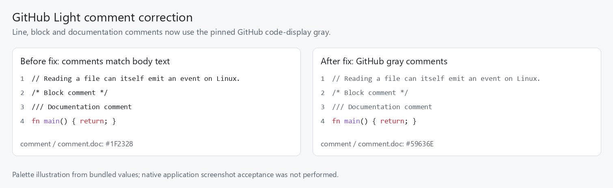
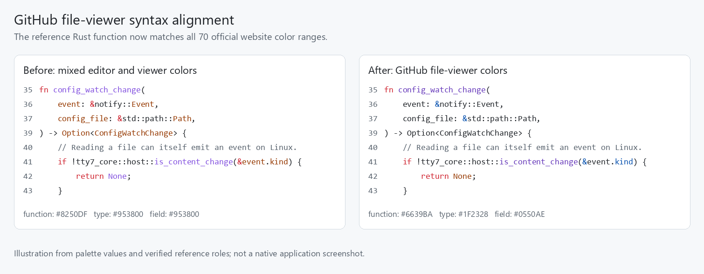
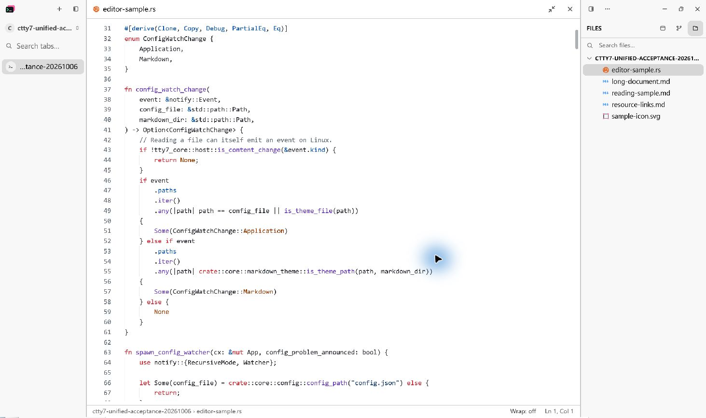
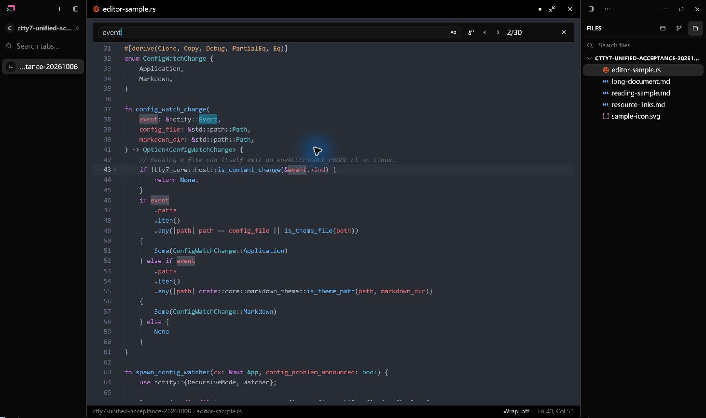

# GitHub Light source editor verification

Tracking issue: [cloudy-liu/ctty7#89](https://github.com/cloudy-liu/ctty7/issues/89).

## Result

Every resolved light application appearance now uses GitHub Light with opaque
white source and gutter backgrounds. Dark appearances retain Atom One Dark.
The existing application appearance contract still controls system following,
custom themes, previews and cancellation. Settings name the actual palette in
English, Chinese and Japanese; source typography stays independent.

The light palette uses GitHub's default file-viewer prettylights syntax tokens
captured on 2026-10-06, including gray comments (`#59636E`) and deep purple
functions (`#6639BA`). Its pinned source records the published stylesheet URL,
capture date and checksum. Selection uses the website token `#0969DA33`.
Editable control colors retain the CodeMirror source tokens where the file
viewer has no equivalent; source typography stays independently configured.


This is a palette illustration from bundled values, not a native screenshot.

## Automated verification

- The existing editing-state regression first failed when the required light background changed from `#FAFAFA` to `#FFFFFF`, then passed after the palette replacement.
- All 17 tests selected by `editor_` passed, covering authored source/control colors, settings, typography, search contrast, preview cancellation, configuration reload, editing state, language queries and embedded code.
- The production highlighter checks 220 retained dark TextMate expectations and 93 representative GitHub Light expectations across 21 languages, plus 70 actual file-viewer color ranges in the reference Rust function. Reference ranges are checked against their source text.
- Both palettes share 157 syntax capture names. Four light subroles use existing parent styles in dark mode, preserving dark colors, private query qualification and language injections. All 38 private language queries compile without changing shared registrations.
- Offline regeneration reproduces the bundled palettes. The Atom One Dark generated file, pinned source and license remain byte-identical to the fork's main branch.
- The locked Windows workspace build passed. No dependency, component revision, lockfile or configuration schema change was required.
- The full locked workspace test run passed 2,977 tests plus all 13 CLI end-to-end cases, with 8 existing ignored tests and no failures after supplying the required Windows shell PATH.
- Formatting, whitespace and the host-boundary check passed; the boundary check covered 98 UI and terminal files.

```powershell
python scripts/sync-editor-themes.py
cargo test --locked -j 2 --features updater --bin tty7-app editor_
cargo test --locked -j 2 --workspace --features updater
cargo build --locked -j 2 --workspace --features updater
cargo fmt --all --check
git diff --check
bash .github/scripts/check-host-boundary.sh
```

The Windows CLI integration tests require Git's `usr/bin` directory on the
test process PATH so their existing `sh` subprocess can start. This is an
environment prerequisite, not an application or repository change.

## Earlier gray comment correction

The initial implementation used the CodeMirror comment token `#1F2328`, which
made comments look like ordinary text. The follow-up screenshot clarified the
expected GitHub gray. Both `comment` and `comment.doc` now use the pinned
`prettylights-syntax-comment` token `#59636E`.



This illustration uses bundled values, not a native application screenshot.

- The production highlighter regression failed before the mapping change with nine gray-comment mismatches, including the exact Rust comment from the user's screenshot.
- After regeneration, all 17 editor-focused tests passed, including Rust line, block and documentation comments, JavaScript line, block and documentation comments, and Python line comments.
- Comparing parsed palettes confirms that only `comment` and `comment.doc` changed; every other light value and all 157 capture names are retained.
- Offline generation reproduces both palettes; the dark palette, pinned source, license and TextMate reference corpus remain byte-identical to the initial implementation.
- The full locked workspace suite passed again with 2,977 tests and all 13 CLI end-to-end cases, with 8 existing ignored tests and no failures; the locked Windows workspace build, formatting, whitespace and host-boundary checks also passed after the correction.

## GitHub file-viewer alignment

A direct comparison with GitHub's rendered `src/main.rs` lines 35–59 found
37 mismatched color ranges after the gray-comment correction. The reference
fixture now records all 70 continuous ranges from the page's actual
`stylingDirectives`, resolved against its published light stylesheet.
The production highlighter matches every range after the correction.

- Functions use file-viewer purple `#6639BA`, replacing CodeMirror purple `#8250DF`.
- Rust parameters, variables and type names use body text `#1F2328`; fields and reference `&` use `#0550AE`.
- Bare Rust variants use `#953800`, while called constructors retain function purple, including generic calls and injected macro bodies.
- Selection uses the file-viewer token `#0969DA33` rather than CodeMirror's `#54AEFF66`.
- Dark source assets and the 220 authored dark expectations remain unchanged; fonts and line spacing remain independently configured.



This illustration uses bundled values and verified reference roles, not a
native application screenshot.

## Review

For the initial implementation at `f428d547`, separate Standards and Spec
reviewers examined the complete staged change
against fork/main at `814b4036`. Both reported no actionable findings. Their
read-only checks confirmed reproducible palettes, identical dark assets and
reference samples, shared capture vocabulary and the documented fidelity limits.

For the file-viewer follow-up against `531a6e9b`, separate Standards and Spec
reviewers examined the complete staged change, including the final scoped and
generic constructor rules and macro regression. Both reported no actionable
findings. Their checks did not replace the final automated validation above.

## Windows native acceptance on 2026-10-06

The native Windows application was exercised at the existing 175% display
scale after merging fork/main into this branch. The source and gutter stayed
white under a custom light gradient, wallpaper and transparency. Dark mode
used Atom One Dark. An unsaved edit, cursor, scroll position and undo survived
theme and fill/dock changes. Searching for `event` found 30 matches; advancing
the counter moved the distinct current-match highlight.





Acceptance found that long paths could wrap outside the fixed-height footer
and dismissing the theme palette returned focus to the terminal. The footer
now truncates its path and reserves the cursor label. The palette restores
its prior focus; the source/reading regression failed before this correction
and passed afterward. All 18 editor-focused tests passed on the corrected
branch, and its locked Windows workspace build passed.

The 2026-10-06 follow-up rebuilt the Windows application and checked the
corrected footer in a docked source pane. Its long path stayed on one line,
with wrapping controls and the cursor label visible. Opening and dismissing
the palette returned focus to the source: Right moved line 13, column 9 to
column 10 without another click. PR #90's nine CI jobs passed on `73e99d52`,
and its merge closed issue #89 as completed.

## Verification limits

macOS/Linux native source-editor visual acceptance was not performed. Their
Markdown screenshots are recorded separately in the Markdown acceptance
document. Native screenshots above establish Windows appearance; automated
GPUI tests cover state and focus behavior. Additional Windows DPI and 200%
application-scale checks remain outside the user-approved acceptance scope.

Tree-sitter maps existing syntax roles to website colors rather than reproducing
every browser or TextMate grammar. CMake, C#, GraphQL, Protocol Buffers and Swift
retain the existing readable fallback because their bundled highlight queries
are empty. Semantic tokens and bracket-pair coloring remain outside this change.
