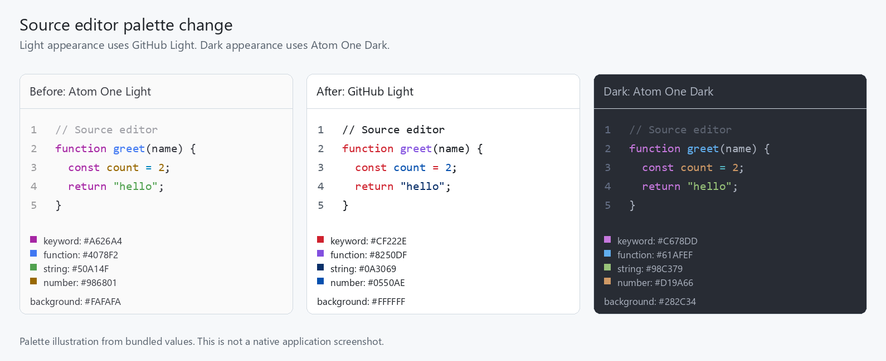

# GitHub Light source editor verification

Tracking issue: [cloudy-liu/ctty7#89](https://github.com/cloudy-liu/ctty7/issues/89).

## Result

Every resolved light application appearance now uses GitHub Light with opaque
white source and gutter backgrounds. Dark appearances retain Atom One Dark.
The existing application appearance contract still controls system following,
custom themes, previews and cancellation. Settings name the actual palette in
English, Chinese and Japanese; source typography stays independent.

The light palette uses GitHub's default website CodeMirror tokens captured on
2026-10-06. Its pinned source records the published stylesheet URL, capture
date and checksum. CodeMirror comments use dark foreground and functions use
purple; GitHub's read-only code viewer has different tokens for those roles.
Roles without a specific CodeMirror token use the corresponding website
prettylights or interface token, as documented with the bundled assets.



This is a palette illustration from bundled values, not a native screenshot.

## Automated verification

- The existing editing-state regression first failed when the required light background changed from `#FAFAFA` to `#FFFFFF`, then passed after the palette replacement.
- All 17 tests selected by `editor_` passed, covering authored source/control colors, settings, typography, search contrast, preview cancellation, configuration reload, editing state, language queries and embedded code.
- The production highlighter checks 220 retained dark TextMate expectations and 85 independent GitHub Light expectations across 21 languages. Reference token ranges are also checked against their source text.
- Both palettes retain the same 157 syntax capture names, preserving private query qualification and language injections. All 38 private language queries compile without changing shared registrations.
- Offline regeneration reproduces the bundled palettes. The Atom One Dark generated file, pinned source and license remain byte-identical to the fork's main branch.
- The locked Windows workspace build passed. No dependency, component revision, lockfile or configuration schema change was required.
- The full locked workspace test run passed 2,977 tests plus all 13 CLI end-to-end cases, with 8 existing ignored tests and no failures after supplying the required Windows shell PATH.
- Formatting, whitespace and the host-boundary check passed; the boundary check covered 98 UI and terminal files.

```powershell
python scripts/sync-editor-themes.py
cargo test --locked -j 2 --features updater --bin tty7-app editor_
cargo test --locked -j 2 --workspace --features updater
cargo build --locked -j 2 --workspace --features updater
cargo fmt --all --check
git diff --check
bash .github/scripts/check-host-boundary.sh
```

The Windows CLI integration tests require Git's `usr/bin` directory on the
test process PATH so their existing `sh` subprocess can start. This is an
environment prerequisite, not an application or repository change.

## Review

Separate Standards and Spec reviewers examined the complete staged change
against fork/main at `814b4036`. Both reported no actionable findings. Their
read-only checks confirmed reproducible palettes, identical dark assets and
reference samples, shared capture vocabulary and the documented fidelity limits.

## Verification limits

Native application screenshot acceptance and macOS/Linux native visual
acceptance were not performed. Application-window interaction tests use GPUI
headless windows; the comparison image establishes palette differences only.

Tree-sitter maps existing syntax roles to website colors rather than reproducing
every browser or TextMate grammar. CMake, C#, GraphQL, Protocol Buffers and Swift
retain the existing readable fallback because their bundled highlight queries
are empty. Semantic tokens and bracket-pair coloring remain outside this change.
