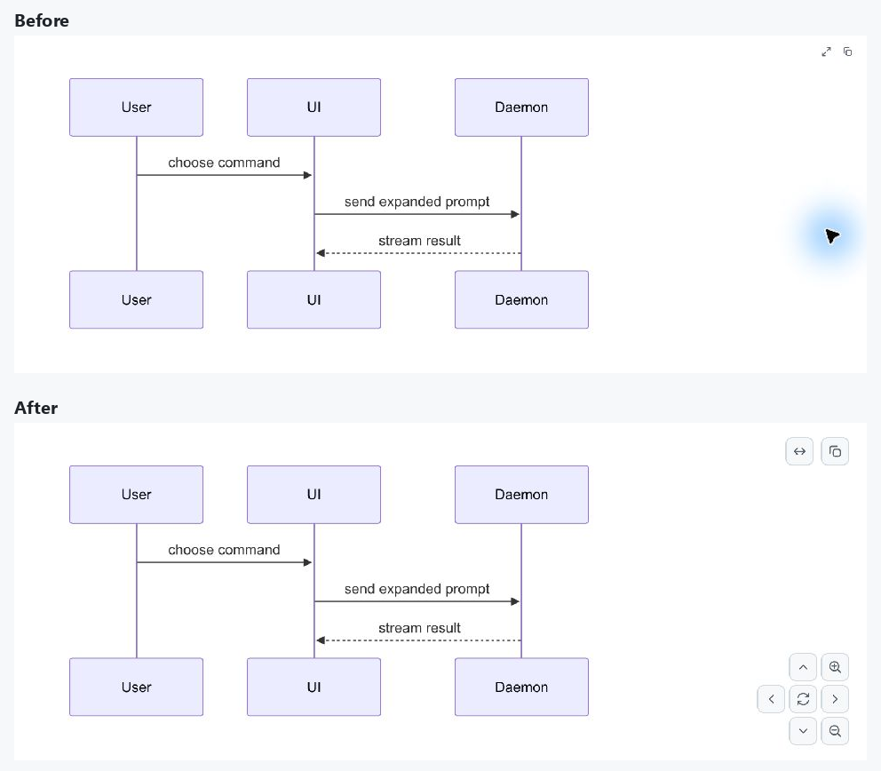
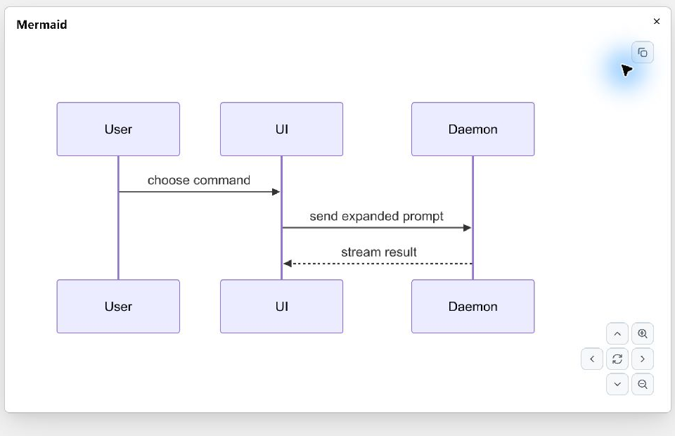

# Mermaid control verification

Verified on Windows on 2026-10-09 at 175% system DPI and 100% application scale,
using the production Markdown reading view and its native fixture.

The reference is GitHub's diagram toolbar shown in the issue report: expand and
copy at the upper right, with directional movement, reset, and zoom controls at
the lower right. The original reading view exposed only two compact buttons;
navigation was available in a separate dialog as a compact horizontal row.

## Result

- Both inline diagrams and the expanded viewer use 32-pixel controls with 16-pixel icons.
- Expand and source Copy appear at the upper right. Four directional controls surround Reset, with Zoom in and Zoom out in the right column.
- Each diagram retains its own viewport while interacting. Reset restores its initial fit and position. Source or theme regeneration creates a fresh viewport.
- The inline image retains its natural display size, subject to the available space. The toolbar has reserved space so its controls do not cover the fitted diagram.
- Copy preserves the original diagram source. SVG rendering and the editor buffer remain unchanged.
- The opt-in native fixture includes the application's dialog layer so expansion can be verified.

## Checks

- The symptom-specific regression test failed before the change because inline navigation controls were absent. The final test exercises the production reading view in a full native-style test window and verifies size, placement, zoom, pan, reset, and source copying.
- New icon paths resolve through the application's asset source and contain SVG artwork.
- Native light and narrow dark previews were inspected. Zoom, directional movement, dragging, reset, source Copy, and the expanded dialog were exercised.
- Native source Copy exactly matched the seven-line sequence diagram, including all seven LF line endings.
- `cargo test --workspace --locked`: 2984 passed, 8 ignored, 0 failed. The test process uses Git's existing Unix tools on PATH.
- Formatting, diff checks, and the native fixture build with `markdown-visual-tests` passed. The fixture uses the dev profile and a temporary binary target to avoid replacing the existing debug application.

## Scope

This change concerns the native diagram controls and their layout. CRLF fence
recognition, Skill metadata tables, and ordinary code Copy sizing are tracked
in `cloudy-liu/ctty7#118`. Native interaction checks were run locally on Windows;
the eight ignored workspace tests were not run.
