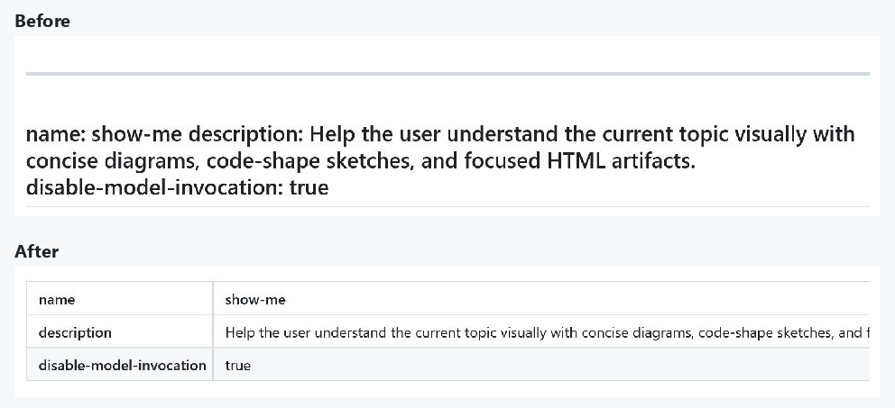
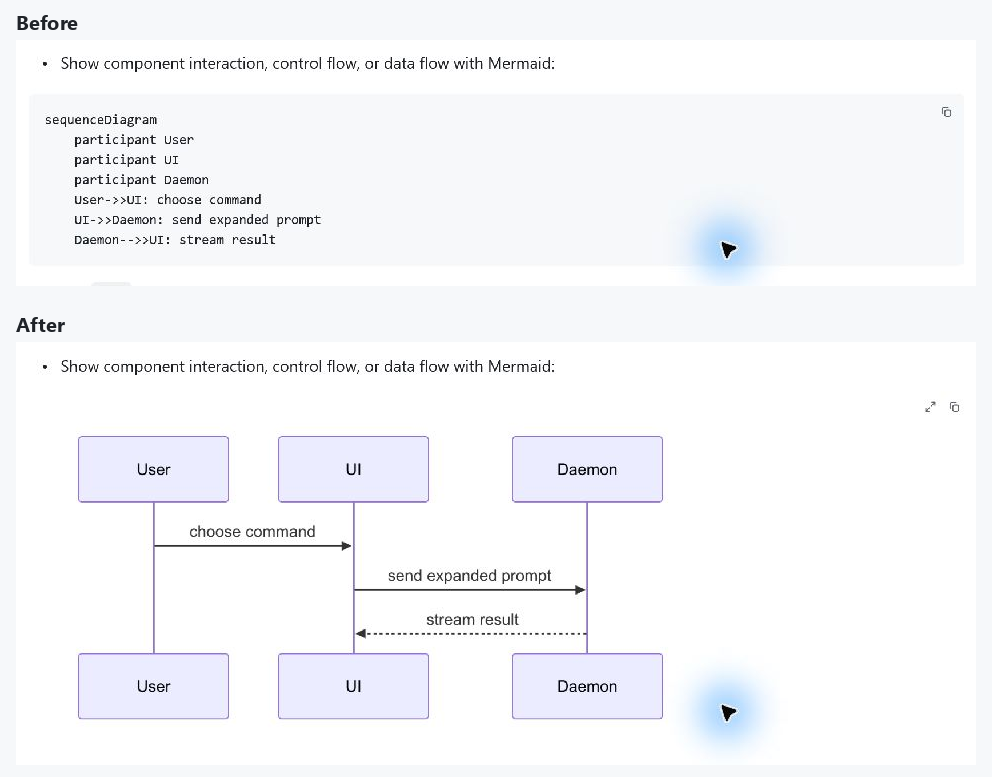
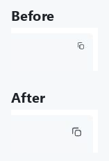

# Skill Markdown preview verification

Verified on Windows on 2026-10-09 with the production Markdown reading view
and the native visual fixture, at 175% system DPI and 100% application scale.
The reference is [show-me's SKILL.md](https://github.com/humanlayer/skills/blob/main/plugins/show-me/skills/show-me/SKILL.md).

## Reproduction

On the unmodified preview, the opening YAML delimiter became a horizontal rule
and the closing delimiter turned the metadata into a setext heading. GitHub
instead shows the same `name`, `description`, and boolean field as table rows.
This was Markdown interpretation, not corrupted character encoding.

The downloaded LF document rendered its sequence diagram. Converting the same
document to CRLF reproduced the unrendered Mermaid code block. The shared fence
matcher did not accept the carriage return after `mermaid`, so the diagram
never reached the renderer.

## Native evidence

The light 1000-by-800 viewport now shows metadata rows and the sequence diagram.
The release build also passed the dark 700-by-800 viewport check. Diagram copy
matched the original source exactly, including all seven CRLF line endings.
Metadata keys are centered and bold, the second row uses the GitHub stripe,
and long values wrap within the viewport. Column-header tables retain their
existing stripe order and horizontal scrolling.

Code Copy uses a 32-pixel target and a 16-pixel icon at 100% application scale,
in place of the 20-pixel target and 12-pixel icon. Clicking near the enlarged
button's edge copied the complete block, including its indentation.

These are cropped native captures with comparison labels added. Document text
and diagram pixels are unchanged.

## Automated checks

- Both symptom-specific regression tests failed before the fix and passed after it.
- Metadata tests cover source order, LF/CRLF, BOM, folding, multiline and nested values, escaping, invalid YAML, and incomplete delimiters.
- GPUI tests cover metadata with Mermaid enabled or disabled, unsaved edits, removal of metadata, source preservation, and theme/selection stability with CRLF diagrams.
- Invalid Mermaid syntax still falls back to a code block.
- `cargo test --workspace --locked`: 2990 passed, 8 ignored, 0 failed.
- GPUI component text tests: 70 passed, including HTML row headers, column headers, alignment, and stripe order.
- `cargo fmt --all -- --check` and `git diff --check`: passed.
- The production native fixture built with `markdown-visual-tests` in the dev profile. A temporary binary name avoided replacing the existing local debug executable; the saved manifest retains the normal application targets.

## Scope

Nested values display as literal YAML rather than nested browser tables.
The native text engine may break long field names at different positions from
GitHub's browser text engine.
The standalone visual fixture omits the application's dialog layer, so this
pass does not revalidate the expanded diagram viewer, zoom, or pan controls.
The eight ignored workspace tests were not run.
