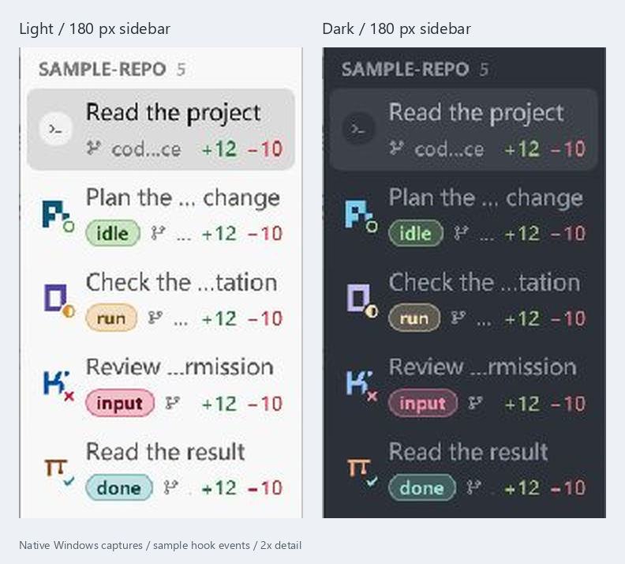
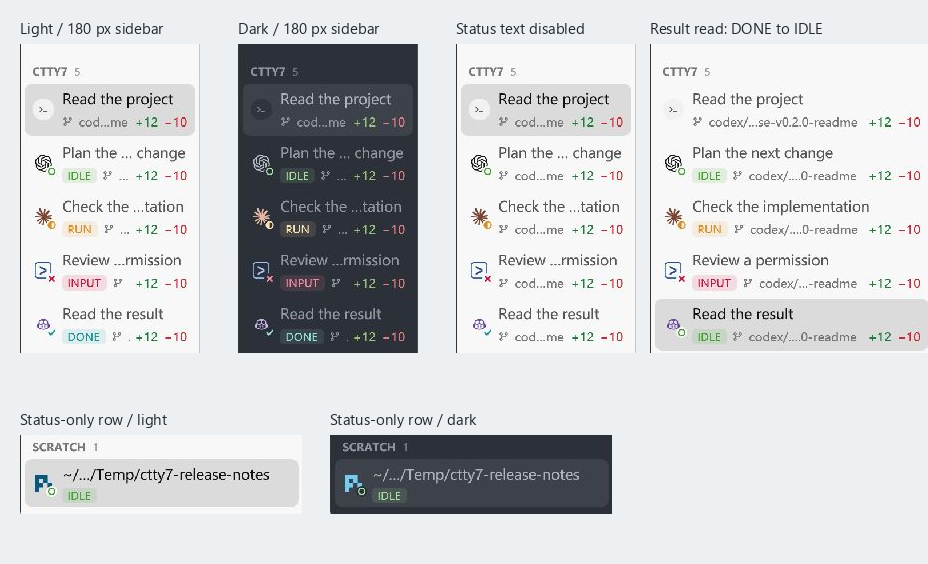

# Compact sidebar status acceptance

## Lowercase capsules, 2026-10-09

The current revision uses `idle`, `run`, `input`, and `done` capsules with full
rounding, semibold text, a 24% state-colour fill, and a thin outline. Light
appearance uses deeper text in the same hue. Width measurement includes the
semibold glyphs, padding, and outline.

These Windows captures came from the local 0.2.1 debug build, using separate
light and dark configurations and sample hook events. The sidebar crops are
enlarged 2x; captions sit outside the application pixels. Both appearances show
all four capsules at the minimum 180 logical-pixel width, alongside an elided
long branch and intact `+12` / `−10` counts. The ordinary shell has no capsule.

`cargo fmt --all -- --check`, `cargo test --locked --workspace`, and
`cargo build --locked --workspace --features gpui/test-support` passed. The
existing tag-mapping assertion now expects lowercase labels. Native captures
for this revision were taken on Windows only.

## Original compact tags, 2026-10-07

Checked on Windows on 2026-10-07 for cloudy-liu/ctty7#100. Implementation PR
cloudy-liu/ctty7#103 is merged; its child issue cloudy-liu/ctty7#101 is closed.
The parent issue closed when cloudy-liu/ctty7#115 merged this acceptance record
and its documentation updates. The user authorized the release preparation
on 2026-10-08.

The production application was built from `b4f7b086` with the workspace version
set to 0.2.0. Computer-use screenshots came from an isolated configuration and
sample hook events, not real requests to agent services.

This image combines crops of native captures. Labels outside the crops describe
the case; the application pixels have not been redrawn.

| Case | Result |
| --- | --- |
| Light and dark appearance | IDLE, RUN, INPUT, and DONE use distinct state colors and faint filled tags. |
| Minimum sidebar width, 180 logical pixels | All four tags remain visible; branch text elides and diff counts remain visible. |
| Status text disabled | Tags disappear and avatar state symbols remain. |
| Non-repository directory | The tag precedes the working directory. |
| Directory already used as the tab title | The duplicate directory is omitted; the status-only row remains visible in both appearances. |
| Unread result selected | DONE changes to IDLE; a later background completion produces DONE again. |
| Ordinary shell | No agent tag appears. |

The complete Windows workspace suite passed, including the existing
StatusIndicator, sidebar fitting, focused-pane, unknown-state, and unread-state
regressions. Unknown-agent and split-pane ownership were covered by those tests,
not by new native screenshots. macOS and Linux tag screenshots were not taken.

The status guide, sidebar guide, configuration reference, and both READMEs now
describe the uppercase tags. The status guide also reflects the already-merged
Codex ready-prompt detection fix.
