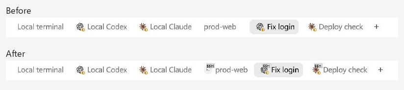
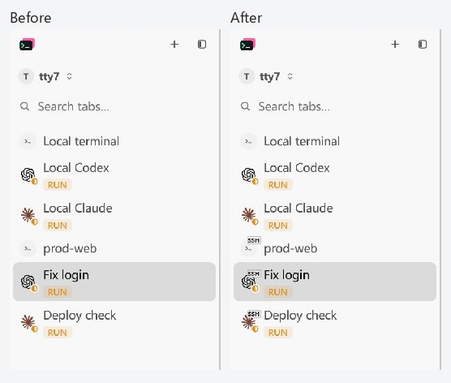

# SSH tab identity visual evidence

Captured on Windows with the Computer Use skill and
`@oai/sky.get_window_state` for cloudy-liu/ctty7#122 on 2026-10-10.
Both versions run the production GPUI application with the same six sessions,
light theme, and 1200 by 660 logical content area. The full captures are
1202 by 691 pixels including the Windows frame.





These images combine unscaled crops of native application screenshots. The
Before and After labels are outside the crops; application pixels have not
been redrawn. The top comparison includes all six tabs; the sidebar comparison
includes all six rows.

SSH keeps the original Agent or terminal icon and adds a small boxed `SSH`
badge at its upper right. The Agent status symbol stays at the lower right.
Each tab has one main icon and one name, with no second Agent logo beside the
name. The badge is 18 by 10 logical pixels with a thin border, slight corner
rounding, and an opaque theme background.

| Session | Before | After |
| --- | --- | --- |
| Local terminal | Terminal name | Same terminal name |
| Local Codex and Claude Code | Agent logo and name | Same Agent logo and name |
| Native SSH shell, prod-web | Name without SSH identity | Terminal icon with an SSH badge and one name |
| Terminal-entered SSH running Codex, Fix login | Codex avatar looks local | Original Codex logo with SSH badge and status |
| Native SSH running Claude Code, Deploy check | Claude avatar looks local | Original Claude logo with SSH badge and status |

The fixture sends deterministic daemon messages through loopback transport.
It exercises the real tab strip and sidebar renderers, but opens no network
SSH connection and does not test remote Agent detection. An Agent logo appears
only when the existing detection path has reported an Agent.

Before source: `90d9a3cb564c63824d15547eaef1f9a4aa4762b2`. The capture runner
overlays the fixture entry point and enables its quiet transport helpers;
it leaves the baseline tab selectors and renderers unchanged.

After source: `5a74d3064d36685210b7e133ed38284b9a5bbc47`, plus the fixture's
optional `hold_seconds` setting. That setting only keeps the window open
long enough for Computer Use and does not change rendering. The original
12-second default was also exercised on Windows and exited with code zero.

Full Computer Use captures:

| Surface | Before | After |
| --- | --- | --- |
| Top tabs | [PNG](images/ssh-tabs-windows-before-top.png) | [PNG](images/ssh-tabs-windows-after-top.png) |
| Sidebar | [PNG](images/ssh-tabs-windows-before-sidebar.png) | [PNG](images/ssh-tabs-windows-after-sidebar.png) |

[Capture metadata](ssh-tab-captures.json) records source revisions, timestamps,
image hashes, and crop rectangles. Both versions were built locally with
`cargo build --locked --features markdown-visual-tests --bin tty7-app`.
Each process uses its own throwaway configuration directory.

For manual capture, pass `--config-dir <temporary-directory> --ssh-tab-visual
<options.json>` to the feature-enabled binary. The JSON options are:

```json
{"sidebar": false, "output": "capture.png", "hold_seconds": 180}
```

Set `sidebar` to `true` for the sidebar view. On Windows, wait for
`NATIVE_SSH_TABS_READY`, select the window titled `SSH tab visual acceptance`,
and capture it with Computer Use. The `output` path is used by the macOS
renderer; Windows screenshots are saved by Computer Use.

The implementation's [three-platform CI run](https://github.com/cloudy-liu/ctty7/actions/runs/37957945063)
passed. Its `native-ssh-tabs-before-after` artifact also contains Linux / X11
captures of the same corner badge implementation at CI merge
`1d017b84bc1c48bf4b79c2f631b110f1862240f6`.

Regression tests cover empty-title target fallback, literal IPv6 names and
tooltips, manual rename priority, remembered split focus, WSL/local identity,
and clearing SSH identity on exit. Those cases are not claimed as screenshots.
