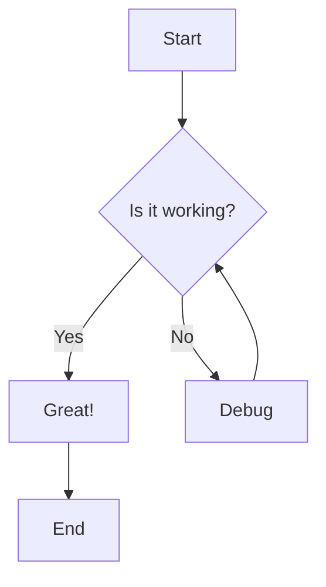
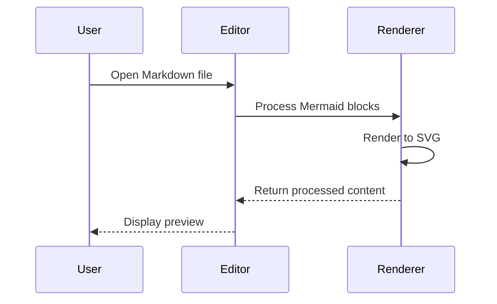
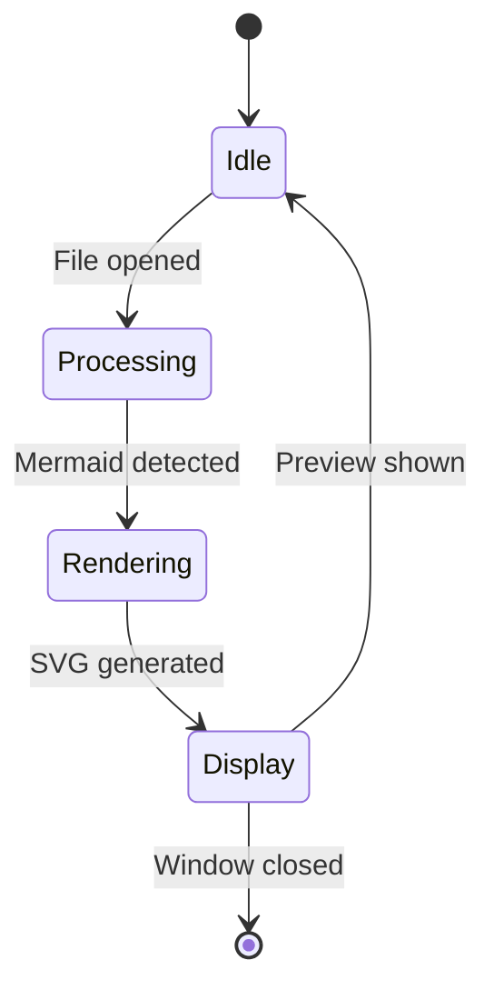
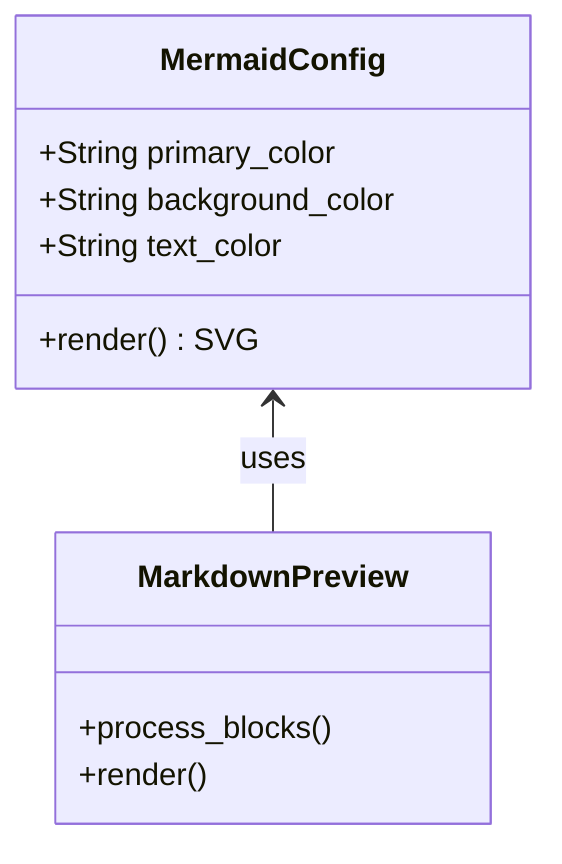
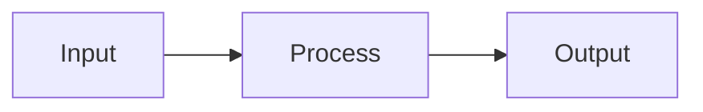

# Mermaid Diagram Test

This file tests Mermaid diagram rendering in the Markdown preview.

## Flowchart



## Sequence Diagram



## State Diagram



## Class Diagram



## Regular Code (should not be processed)

```rust
fn main() {
    println!("This is regular code, not Mermaid");
}
```

## Mixed Content

Some text before the diagram.



And some text after the diagram.
