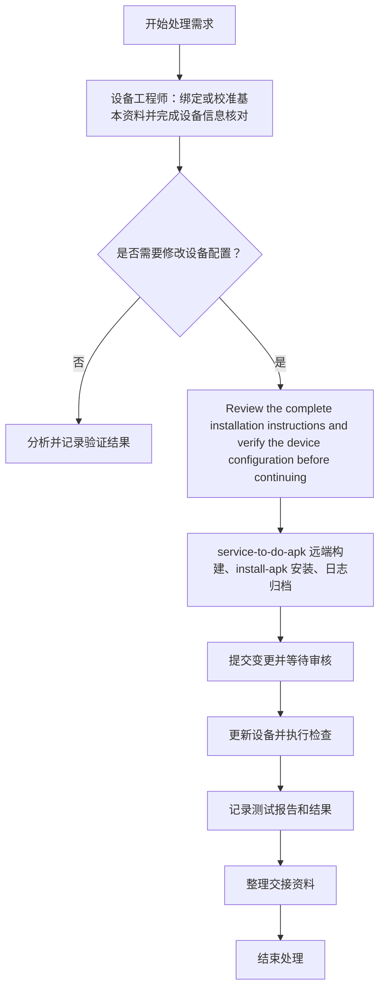
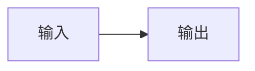
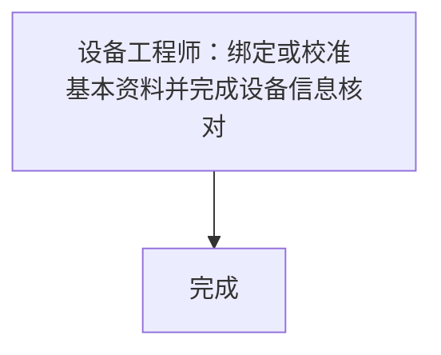

# Mermaid reading

## Long diagram

```mermaid
flowchart TD
    A[开始处理需求] --> B[设备工程师：绑定或校准基本资料并完成设备信息核对]
    B --> C{是否需要修改设备配置？}
    C -->|否| D[分析并记录验证结果]
    C -->|是| E[Review the complete installation instructions and verify the device configuration before continuing]
    E --> F[service-to-do-apk 远端构建、install-apk 安装、日志归档]
    F --> G[提交变更并等待审核]
    G --> H[更新设备并执行检查]
    H --> I[记录测试报告和结果]
    I --> J[整理交接资料]
    J --> K[结束处理]
```

## Short diagram

```mermaid
flowchart LR
    A[输入] --> B[输出]
```

## Explicit line breaks

```mermaid
flowchart TD
    A[设备工程师：绑定或校准<br/>基本资料并完成设备信息核对] --> B[完成]
```
